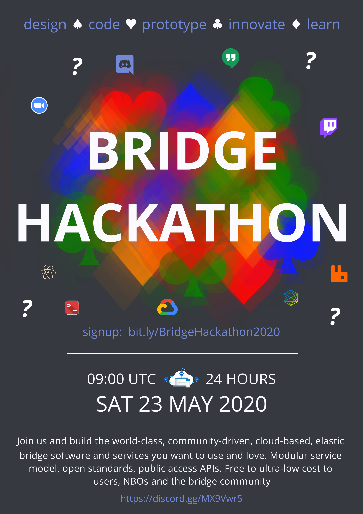

## Documentation 
# [API Documentation Page](https://online-bridge-hackathon.github.io/data-formats/) 

* * *
##### 
@online-bridge-hackathon/data-formats
* * *

* * *

## Installation and Setup

### - PACKAGES

    npm install

## Usage

## CLI

* * *

## Tests

* * *

## Team

* * *

## License

MIT

* * *

